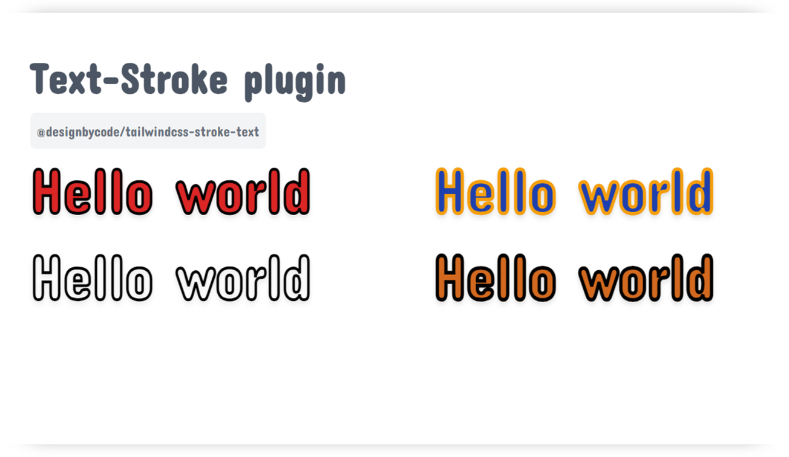

# Tailwind CSS Text Stroke Plugin

Add custom text stroke utilities to your Tailwind CSS project using this plugin. It allows you to apply an outline-like stroke around text using CSS properties supported by WebKit-based browsers.


[](https://github.com/DesignByCode/tailwindcss-text-stroke/stargazers)

[](https://nodei.co/npm/@designbycode/tailwindcss-text-stroke/)



## 🚩 Table of Contents

* [Installation](#installation)
    * [Using pnpm](#using-pnpm)
    * [Using npm](#using-npm)
    * [Using yarn](#using-yarn)
* [Setup](#setup)
* [Use](#use)
    * [Example](#example)
    * [With Modifiers](#with-modifiers)
* [Contributing](#contributing)
* [License](#-license)

## Installation

To use this plugin, you need to install it via pnpm, npm or yarn.

#### Using pnpm

```bash
npm install @designbycode/tailwindcss-text-stroke
```

#### Using npm

```bash
npm install @designbycode/tailwindcss-text-stroke
```

#### Using yarn

```bash
yarn add @designbycode/tailwindcss-text-stroke
```

First, ensure you have Tailwind CSS installed in your project. If not, install it by following the official documentation.

Next, require the plugin in your Tailwind CSS configuration file (usually named tailwind.config.js).

## Setup

1. First, ensure you have Tailwind CSS installed in your project. If not, install it by following the official documentation.

2. Next, require the plugin in your Tailwind CSS configuration file (usually named tailwind.config.js).

```javascript
module.exports = {
    // ...other configurations
    plugins: [
        // ...other plugins
        require("@designbycode/tailwindcss-text-stroke"),
    ],
};
```

Once you've required the plugin and added it to the plugins array, you can use the new text stroke utilities in your HTML templates.

## Use

The Text Stroke plugin provides the following utility classes for styling text with stroke effects:

* .text-stroke: Base component that sets the default text stroke styles. You can override these styles using CSS variables.
* .text-stroke-{value}: Sets the stroke width to the specified {value}. The available options are defined in the textStrokeWidth theme configuration.
* .text-stroke-{color}: Applies a custom color to the text stroke. The {color} should match a color in your Tailwind CSS color palette.
* .text-stroke-fill-{color}: Applies a custom fill color to the text stroke. The {color} should match a color in your Tailwind CSS color palette.

### Example

Here's an example of how you can use the utility classes to apply image masks:

```html
<h1 class="text-7xl font-black text-stroke ">
    Hello, TailwindCSS
</h1>
```

### With modifiers

```html
<h1 class="text-7xl font-black text-stroke text-stroke-indigo-200 text-stroke-fill-indigo-600">
    Hello, TailwindCSS
</h1>
```

## Contributing

Contributions to this plugin are welcome! If you encounter any issues, have feature requests, or want to improve the plugin, feel free to create a pull request or submit an issue on the GitHub repository.

## 📜 License

This software is licensed under the MIT 


